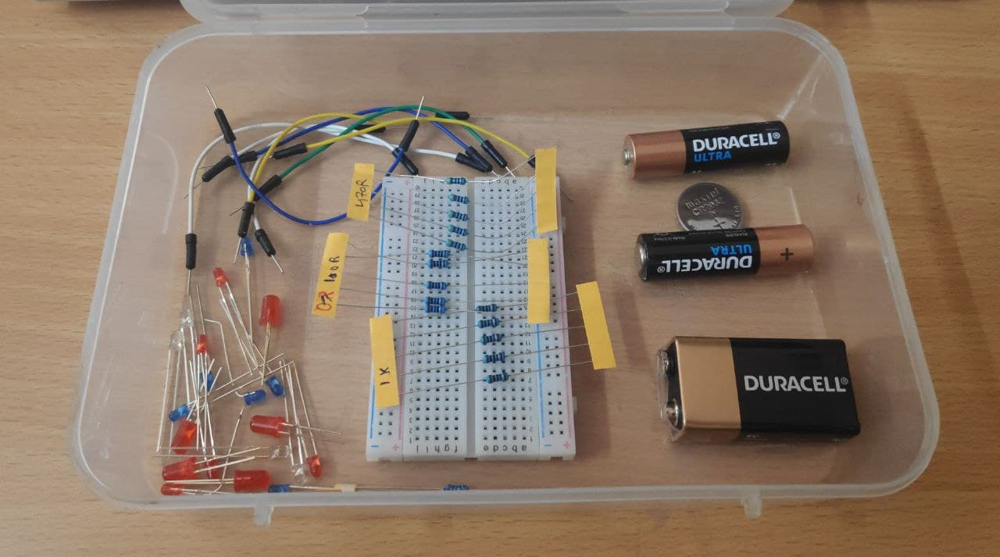

# Basic Electronics Fun Series: ***Polarity Detector*** (Project_1)

**Welcome to Beginner Electronics Fun Series Project#1 !**

We all love glowing LEDs and its a wonder to see different color light emmiting out of these small light sources.

In this project we will simply figure out when LED will glow and when not and then using it to detect the polarity of our battery.

## Time to Open Tinkering Box

Lets see what all components I have addded to Tinkering Box.

  

As we can see we have the following components:

1. LEDs of different colors(red, blue & transparent blue) and sizes (3mm & 5mm).

2. Resistors of different values (100R, 470R, 220R & 1K), Where R = ohms and K = kilo ohms.

3. Batteries (AA battery, CR2032 3v Coin cell, 9v MN1604).

4. Breadboard.

5. Male to Male Jumper wires.

## Lets glow an LED

