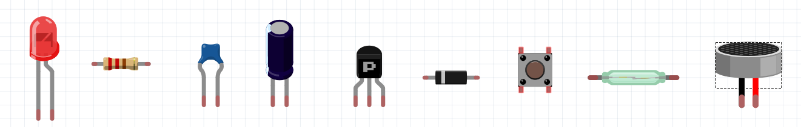
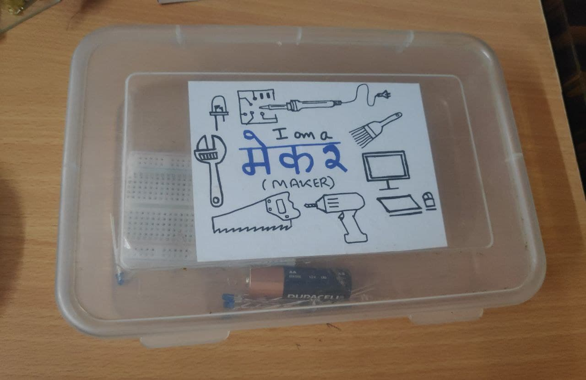

# Beginner Electronics Fun Series

  

### **Welcome to Beginner Electronics Fun Series !**

Electronics are fun and fascinating, our lives are surrounded by interesting electronics gadgets such as Musical Instruments (Piano, guitar etc), Smart Phones, lighting Devices (Bulb, Tubelight etc), Cameras, Computers, Home appliances etc.

Did you ever wondered how these Electronics devices works? And are you curious to explore and learn electronics.

Let me take this opportunity to introduce and invite you all to this **Beginner Electronics Fun Series** to explore and learn electronics by making projects in a open and playful environment.

## Table of Contents
- [Beginners Electronics Fun Series](#beginners-electronics-fun-series)

  - [Table of Contents](#table-of-contents)

  - [What is this Series all about ?](#what-is-this-series-all-about-?)

  - [Starting with Tinkering Box](#starting-with-tinkering-box)

  - [Documentation and Discussion](#documentation-and-discussion)

  - [Lets Start With Beginners Electronics Fun Series Projects](#lets-start-with-beginners-electronics-fun-series-projects)

## What is this Series all about?

This series is a basic series into the world of electronics and provides you a learning playground to get your hands dirty by directly engaging you to do projects.

The projects will help you to explore how electronics components (Such as LEDs, Resistors, Capacitors, transistors etc) and circuit works right from scratch.

I also encourage all of you to come up with your own project ideas and let them happen.

## Starting with Tinkering Box

I am also excited to introduce you to Tinkering Box (But what it is?), okay i made this tinkering box for collecting different components to tinker with.

You can use any empty box and can also call it a Maker Box or Hacker Box or whatever.

  

Initially I have added few LEDs, resistors, one breadboard and one battery. 

And will keep updating this Tinkering Box with new components whenever required to tinker or play around with new projects. 

So I encourage you all to make your own tinkering box and share about it with community.

## Documentation and Discussion

It is always a best practise and also today's need to document your journey of making a project which will help to show the process of making to the community, seeking as well as providing help, creating your digital profile and community formation.

Therfore I strongly recommend you all to document every thing related to your project. While process of making keep taking pictures and videos, post them to your project thread, if stucked anywhere can ask questions, can help other with answers etc.

## Lets Start With Beginner Electronics Fun Series Projects

We will be upadting the below project list as we move forward.

[Project#1: Polarity Detector](https://github.com/ashishkumarpardeshi/Beginner_Electronics_Fun_Series/blob/master/Project%231_Polarity_Detector.md)

## License

- Distributed under the  [CC BY-SA 4.0](https://creativecommons.org/licenses/by-sa/4.0/) license.

  

